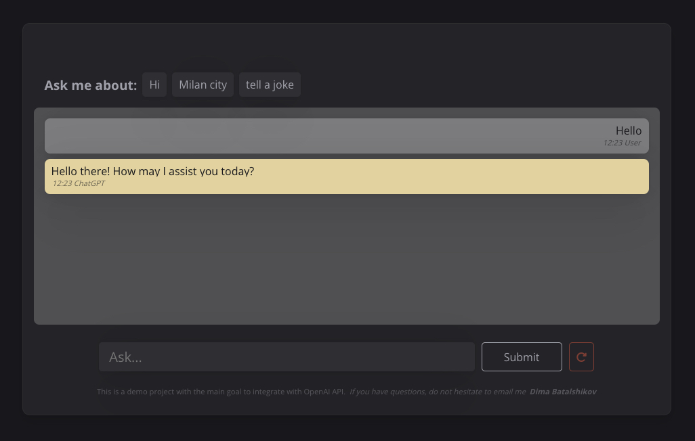
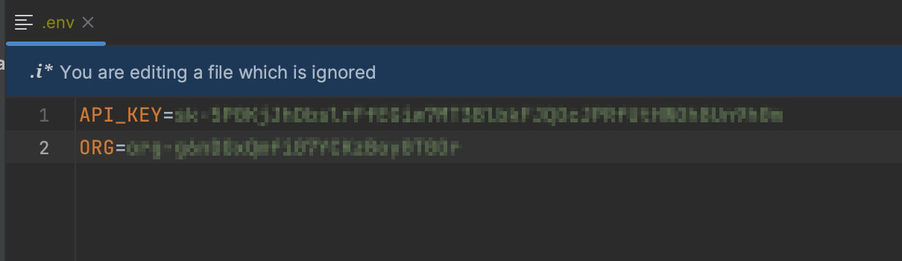

### Please visit project link: [Demo](https://chat-ai-project-demo-aq9c18re0-damiandream.vercel.app/)

# Getting Started with React Ai-Chat demo project

    

https://github.com/DamianDream/chat-ai-project-demo/assets/94145754/218d5a20-e3e0-4f9a-97c9-e1835506c39b

### `Important` 
Before you start testing the project you should do two steps listed below.

- #### Step 1: 
Create OpenAI account and create your private OpenAI "key" and provide "Organization ID".\
Link to `key`: [platform.openai.com/account/api-keys](https://platform.openai.com/account/api-keys) \
Link to `Organization ID`: [platform.openai.com/account/org-settings](https://platform.openai.com/account/api-keys)\

- #### Step 2:
Create `.env` file in project folder and indicate in the file two lines of code indicated below\
`API_KEY=key`\
`ORG=Organization ID`

    

### `npm start`

Runs the app in the development mode.\
Open [http://localhost:3000](http://localhost:3000) to view it in your browser.

The page will reload when you make changes.\
You may also see any lint errors in the console.

### `npm run server`
Runs the localhost server and handle Open-AI API request
Open [http://localhost:3005](http://localhost:3005) to view it in your browser.

### `npm run live`
Runs simultaneously commands "server" + "start" \
Provided via lib "concurrently" \
You can find more about it [npmjs.com/package/concurrently](https://www.npmjs.com/package/concurrently)
